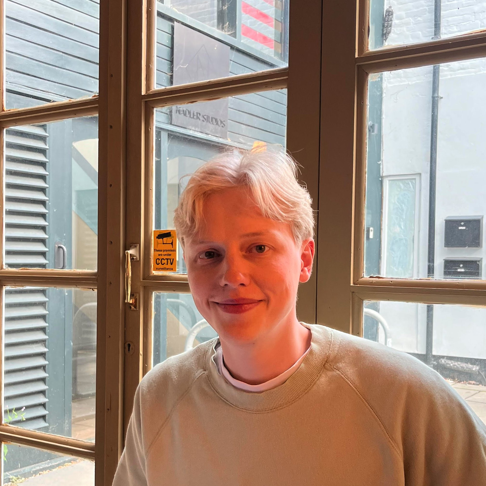

[//]: # (![My headshot]&#40;full_headshot_cropped.jpg&#41;)

[//]: # (Hi, I'm Chris, a Research Engineer currently working in Research and Development within the Data Consulting Space.)

[//]: # (
)

[//]: # (    )

[//]: # (
)

    

 

Hi, I'm Chris, a Research Engineer currently working in the Data Consulting field, helping to develop and implement scalable data-driven solutions for a startup consulting firm.

I work predominantly with Python and common data-focussed libraries (Pandas, Numpy etc.) with SQL. I also have an interest in C programming, especially in the context of homebrew on the Playstation Portable and Playstation Vita handheld consoles.

Outside of programming, I'm interested in lots of different things including (but not limited to):
* Public transport (in particular rail transport such trams 🚋 and trains 🚅)
* Cars (especially late 80s to mid 2000s coupes and hatchbacks)
* Formula 1 🏎 
* British dance music (anything between 140-170 bpm e.g. Dubstep, Garage, Bassline, Hardcore, Jungle, Drum and Bass etc.)

I have a blog where I discuss just about anything I find interesting. You can find it by clicking the 'blog' link above!